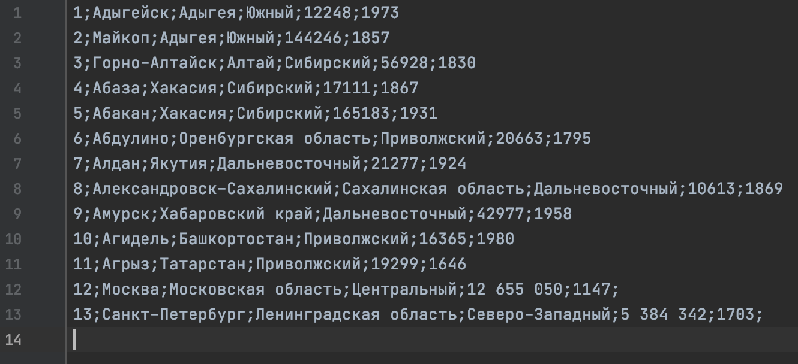
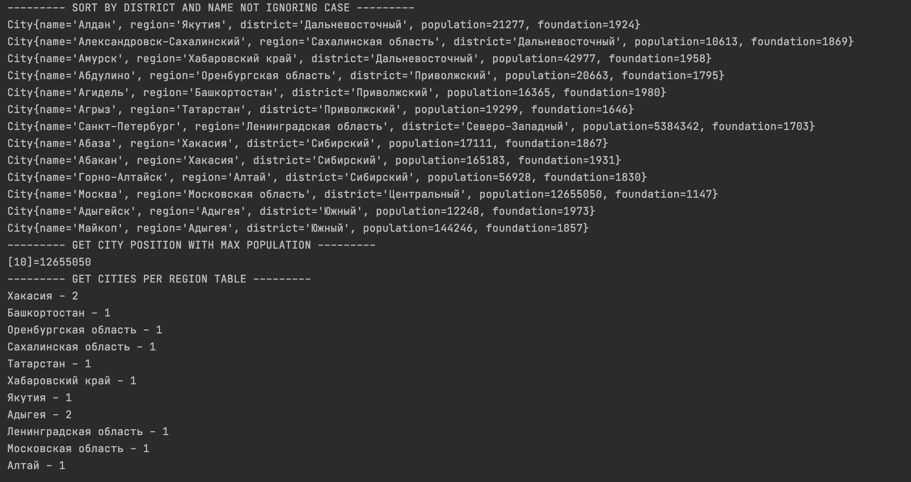
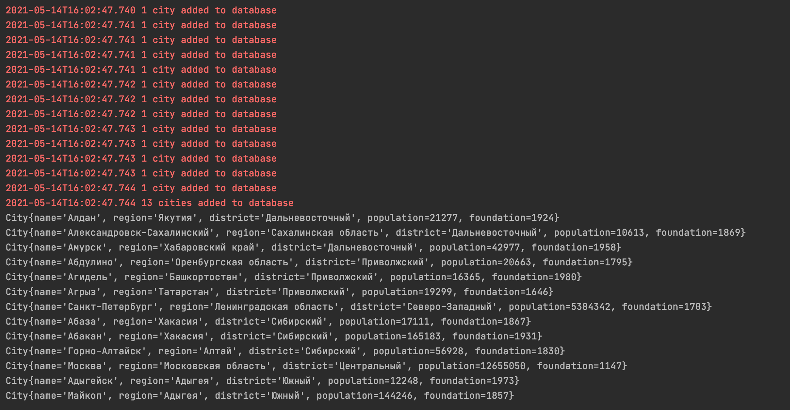

# Cities guide app

Small app to parse a file in format like this:

Create `City` objects and process some queries like this:

Can connect an `H2` database via `JDBC` and process some queries like this:

App is covered with unit tests

Author: Roman Kukin
